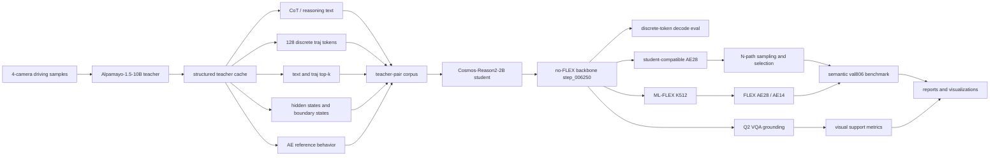
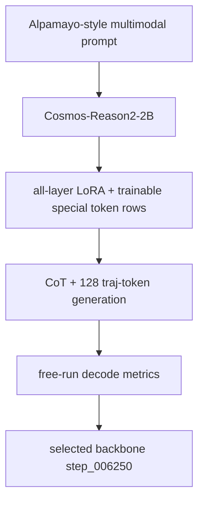
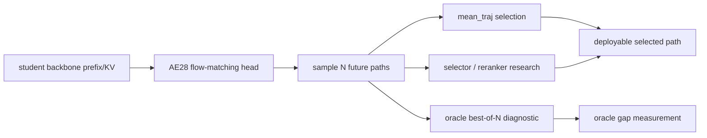
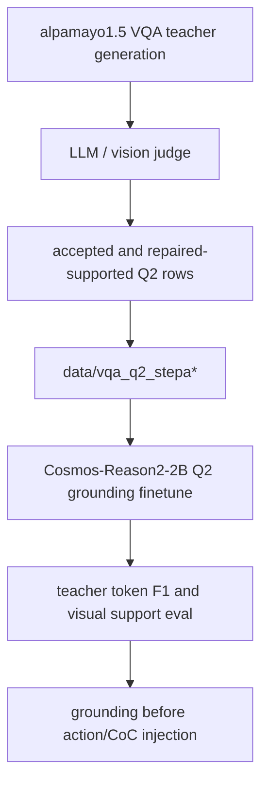
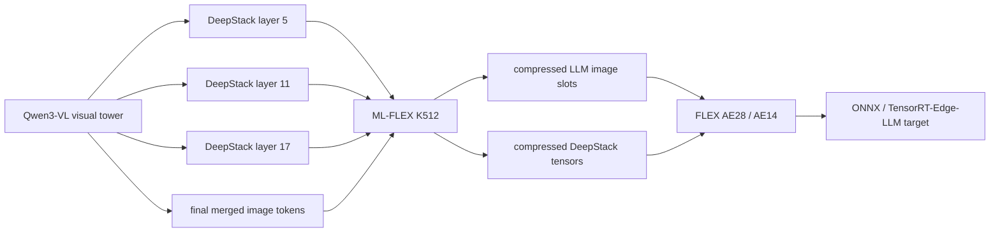
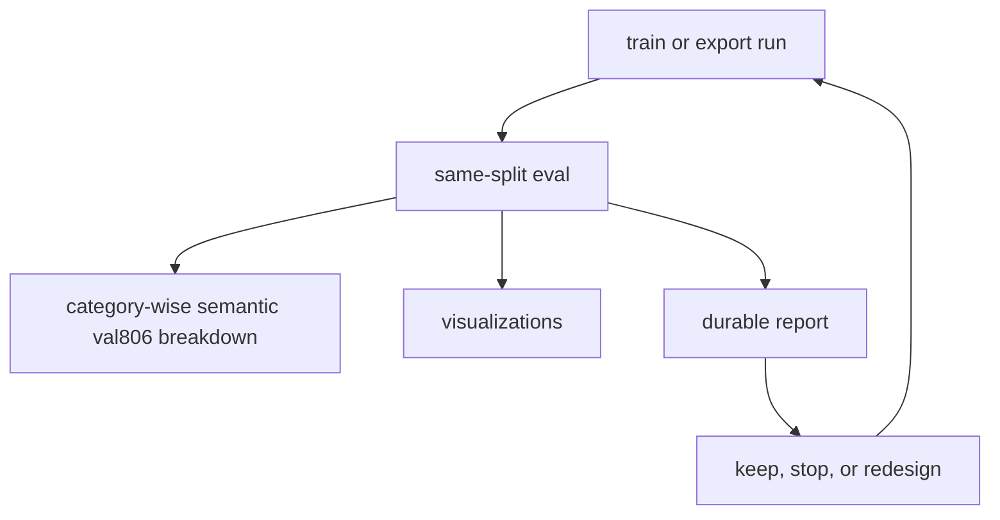

# Distillation Architecture

This document describes the current Alpamayo-to-Cosmos distillation architecture.
It separates the teacher data contract, student VLM distillation, action-expert
training, FLEX compression, Q2 grounding, deployment export, and benchmark loop.

## High-Level System



## Teacher Cache Contract

The teacher is not treated as one blob of labels. The cache has several distinct
supervision channels:

| Channel | Use |
|---|---|
| CoT / reasoning text | Student language and driving-intent prefix |
| 128 discrete trajectory tokens | Student trajectory-token emission and decode diagnostics |
| Text top-k | Optional language KD / confidence analysis |
| Trajectory top-k | Optional trajectory-token KD / diagnostics |
| Hidden and boundary states | Alignment diagnostics, AE conditioning studies |
| AE reference behavior | Action-expert training and comparison |

The important lesson is that these channels are not interchangeable. A loss can
improve while behavior gets worse if it is applied to the wrong target positions
or if hidden/KD labels are semantically misaligned.

## Student Backbone Path



The current no-FLEX backbone reference is:

```text
outputs/checkpoints/no_nav_camera_labeled_official_full444k/
  no_nav_official_full444k_semantic200k_hidden_gc_b16_w4_final_20260526_051838/
  step_006250
```

This checkpoint is selected by decode geometry, not by lowest validation loss.
Greedy discrete decode remains a diagnostic path rather than the deployment
trajectory output.

## Action Expert Path



The AE path exists because final deployment uses continuous action-space
prediction, not only discrete LM trajectory tokens.

Current conclusions:

- AE consumes the backbone KV/cache distribution, so a good token decoder does
  not automatically mean the public teacher AE can be reused.
- No-FLEX AE28 is the quality reference.
- `mean_traj` is a strong baseline for the current candidate distribution.
- The oracle gap is real, but path-only reranking did not beat `mean_traj`.

Report:
[`../reports/140-ae-path-reranker-bootstrap.md`](../reports/140-ae-path-reranker-bootstrap.md).

## Q2 VQA Grounding Path



The current VQA decision is conservative:

- official Q2 is the main target
- official Q1 is too hallucination-prone for a main teacher dump
- Q2-derived Q1 labels can be auxiliary after filtering
- raw 1A context prompts are prompt/debug evidence until scaled and judged

Useful metrics for this path:

- teacher-short token F1
- supported-claim token F1
- action/future language leakage rate
- visual support rate
- unsupported motion/action claim rate

## FLEX And Deployment Path



FLEX is deployment-relevant because it reduces the visual-token interface, but
it currently costs quality on the harder semantic val806 benchmark. DeepStack
must stay active for the AE path, so the useful design is multi-level FLEX, not a
single final-token compressor.

Current benchmark summary:

| Model | ADE GT | minADE6 GT | Latency |
|---|---:|---:|---:|
| 10B teacher | `1.6742` | `0.9280` | `1917 ms` |
| 2B NoFLEX AE28 | `2.7227` | `1.6835` | `616 ms` |
| 2B FLEX K512 AE28 | `3.0818` | `2.0721` | `525 ms` |
| 2B FLEX K512 AE14 | `3.1970` | `2.5478` | `493 ms` |

## Evaluation Loop



The project should not select checkpoints by loss alone. The minimum selection
set is:

- ADE/FDE against GT
- minADE/minFDE for oracle candidate quality
- selected-vs-oracle gap
- category breakdown
- latency
- visual/CoT grounding metrics when language is involved

## Current Architecture Risks

1. FLEX latency improvements are not yet free quality wins.
2. AE14 4-step speedups need category-wise validation, not only small debug sets.
3. VQA grounding must precede direct action/CoC injection; fluent CoT is not the
   same as teacher-grounded intent.
4. QAT should wait until module scope, calibration accounting, quantizer
   save/load, and AE-on-quantized-representation contracts are fixed.
5. Selector/ranker work needs richer features than path geometry alone.

## Source Reports

- [`../reports/138-semantic-val806-4model-benchmark.md`](../reports/138-semantic-val806-4model-benchmark.md)
- [`../reports/139-alpamayo-distillation-retrospective.md`](../reports/139-alpamayo-distillation-retrospective.md)
- [`../reports/140-ae-path-reranker-bootstrap.md`](../reports/140-ae-path-reranker-bootstrap.md)
- [`DATA_PIPELINE.md`](DATA_PIPELINE.md)
- [`EVAL_PLAN.md`](EVAL_PLAN.md)
