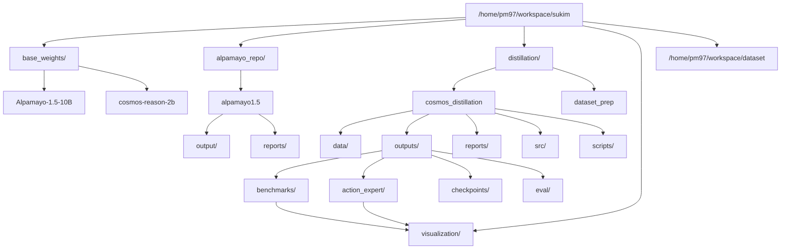
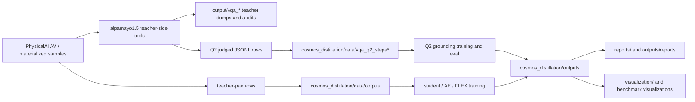

# Workspace Architecture

This document describes how the local `sukim` workspace is organized around the
Alpamayo distillation project. It is intentionally local-path aware because the
repo depends on large model weights, generated teacher caches, benchmark outputs,
and visualization assets that are not normal source-controlled files.

## Top-Level Layout



## Ownership Boundaries

| Path | Role | Commit policy |
|---|---|---|
| `base_weights/` | Local teacher/student model weights | Never commit |
| `alpamayo_repo/alpamayo1.5/` | Teacher-side experiments, VQA prompt audits, teacher dumps | Separate repo/workspace |
| `distillation/cosmos_distillation/` | Main student distillation repo | Commit source, configs, durable reports |
| `distillation/dataset_prep/` | Dataset materialization/export helper area | Commit scripts only when intended |
| `visualization/` | Debug and presentation renders | Local artifact, usually do not commit |
| `/home/pm97/workspace/dataset/` | Shared exported datasets | Local artifact, never commit here |

The practical rule is that `cosmos_distillation` should be able to explain the
experiment, but it should not absorb every generated tensor, benchmark dump, or
rendered image.

## Data Flow



## Important Local Dataset Families

### Teacher-Pair And Semantic Corpora

The main training and benchmark corpora live under:

```text
distillation/cosmos_distillation/data/corpus/
```

Important logical artifacts:

- `no_nav_teacher_pair_full444k_semantic_balanced_200k.jsonl`
- `no_nav_teacher_pair_full444k_semantic_balanced_20k_train_val9007_seed42.jsonl`
- `benchmark_semantic_val_cap50_seed42.jsonl`

These are generated data artifacts. They are important for reproducibility, but
they should not be casually committed because they can be large and may depend on
local materialized sample paths.

### Q2 VQA Grounding Data

Q2 grounding data is derived from Alpamayo-side VQA generation and judging:

```text
alpamayo_repo/alpamayo1.5/output/vqa_*
distillation/cosmos_distillation/data/vqa_q2_stepa*
```

The current operational decision is:

- official Q2 is the main VQA grounding target
- raw Q1 / 1A prompts are auxiliary only after strict filtering
- repaired-supported Q2 rows should be tracked separately from strict accepted
  rows when interpreting metrics

### Benchmarks And Visualizations

The most presentation-ready benchmark visualizations are:

```text
distillation/cosmos_distillation/outputs/benchmarks/
  semantic_val806_4models_20260612/visualizations/
```

The broader local visualization folder contains debug and presentation material:

```text
/home/pm97/workspace/sukim/visualization/
```

Useful examples:

- `step006250_teacher_dashboard/index.html`
- `prompt_only_ae_dashboard/index.html`
- `run_step006250_val_full_4760_b16_student_free_run_k6_bestof6_render_overlay6/`
- `best_backbone_ae_stage2_step15000_category4_20260605/`

## Generated Artifact Policy

Generated directories can be very large. The local `outputs/` tree has included
checkpoints, action-expert states, KV dumps, exported ONNX files, Q2 evals, and
benchmark prediction NPZs.

Normal git scope:

```text
configs/
scripts/
src/
docs/
reports/
tests/
```

Normally exclude:

```text
outputs/
logs/
data/raw/
data/processed/
data/corpus/
data/eval/
data/vqa_q2_stepa*/
```

If a generated artifact must be preserved in git, prefer a small summary file or
report over raw tensors, NPZs, checkpoints, or rendered image batches.

## Why The Separation Matters

The project has several different kinds of evidence:

1. Source code and configs explain how a run is produced.
2. Reports explain why a decision was made.
3. Large outputs contain raw evidence but are not suitable commit payloads.
4. Visualizations are useful for presentations and audits, but they are derived
   artifacts.

Keeping these separate prevents the repo from becoming a checkpoint dump while
still preserving the experiment story.
